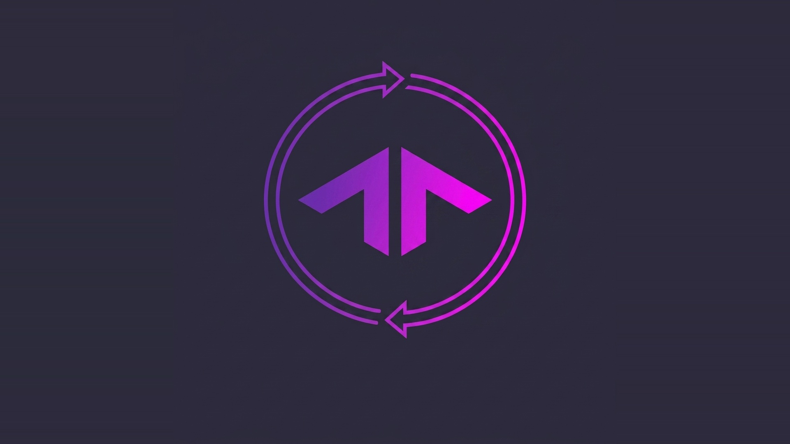
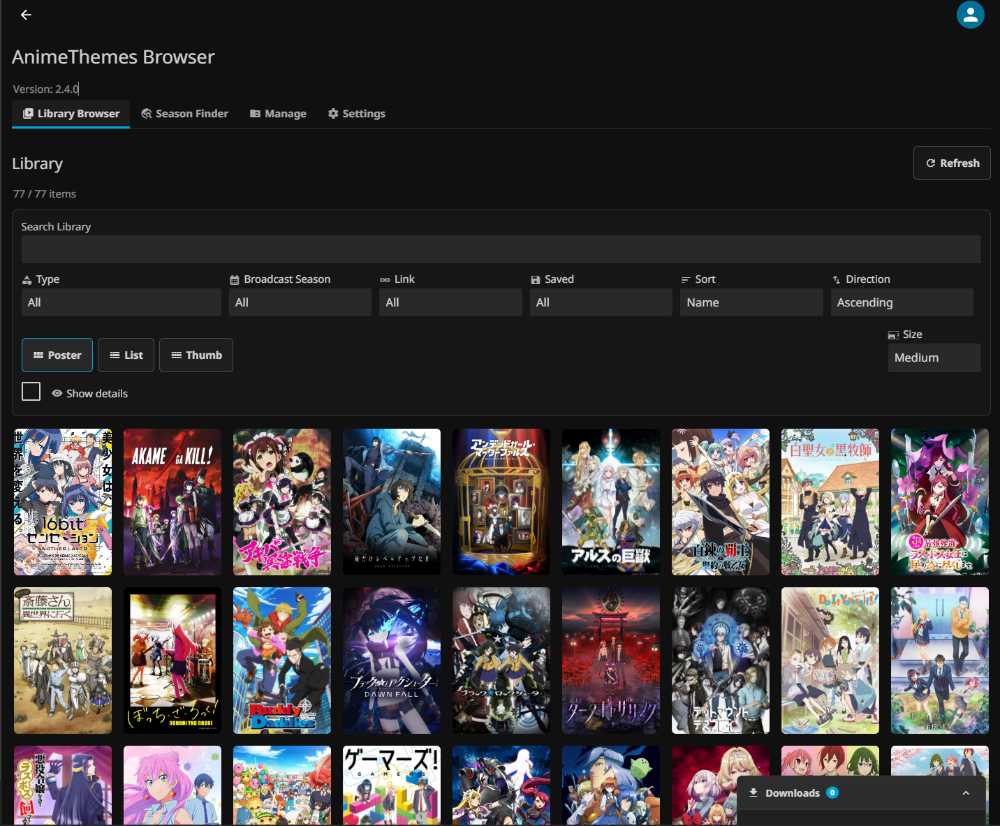
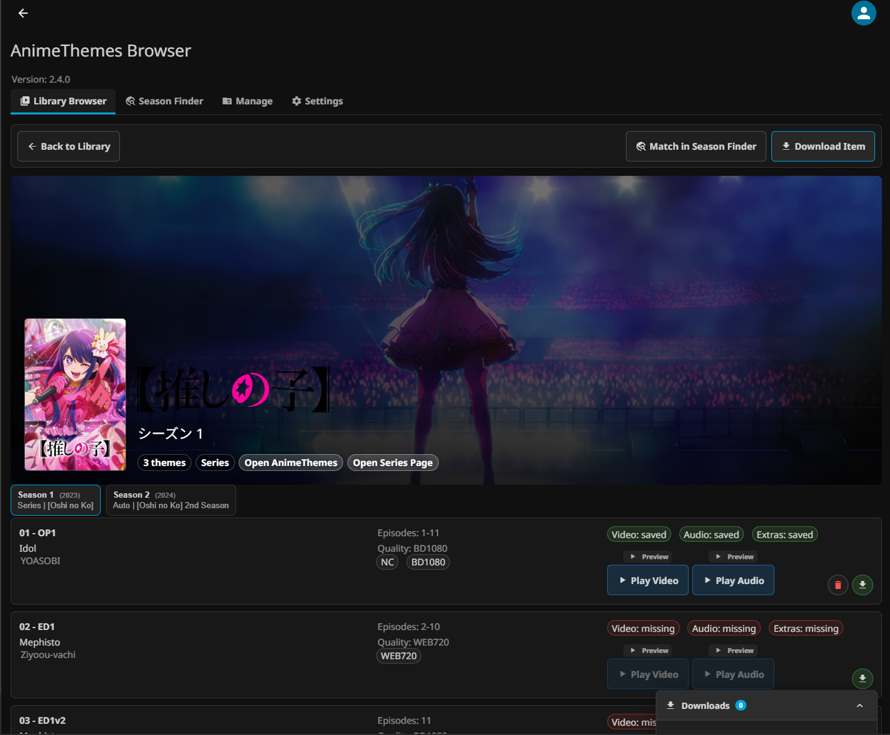
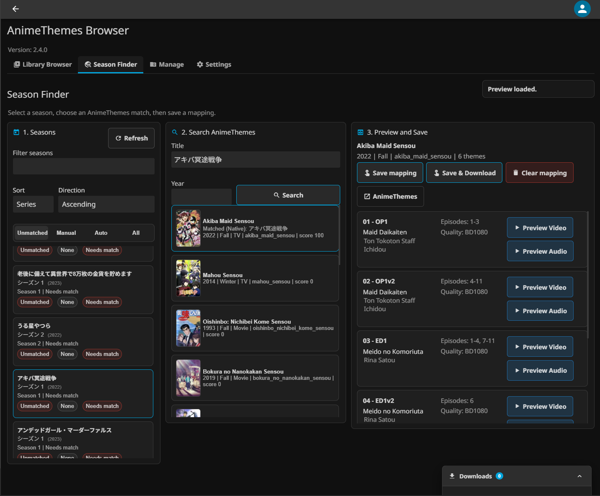

# AnimeThemes Sync Plugin (Jellyfin / Emby)

  

Brings [AnimeThemes.moe](https://animethemes.moe/) OP/ED themes to your anime library: automatic matching, theme video/song downloads, a full management UI, and broadcast-season tags and collections.

[日本語版 README はこちら](README_ja.md)

---

## Screenshots

  
   <em>AnimeThemes Browser — browse, search, filter, and manage your anime library</em>

  
   <em>Theme details per season — preview, play, download individual OP/ED themes</em>

---

## Features

- **Automatic matching** — resolves series, seasons, and movies to AnimeThemes entries via AniList / MyAnimeList IDs, with manual override through external IDs
- **Theme downloads** — OP/ED theme videos (`backdrops`) and theme songs (`theme-music`), optional browsable extras, per media-type limits, volume normalization via ffmpeg
- **Download engine** — job queue with live progress, cancel, retry, and history; segmented (multi-connection) downloads; configurable concurrency
- **AnimeThemes Browser** — an admin page to browse your library with search, filters (type, link state, saved state, broadcast season), sorting, and paging; preview any OP/ED, download individual themes (audio/video/extras selectable), play or delete saved files
- **Season Finder** — review unmatched seasons, search AnimeThemes by title and year, preview candidates, and save per-season mappings without editing JSON; mappings can be exported/imported
- **Broadcast-season automation** — season tags (localizable labels and `{Season} {Year}` format) and auto-created broadcast-season collections with metadata lock and generated poster/thumb/backdrop artwork
- **Maintenance tools** — local media cleanup scanner for plugin-created files, browser/provider cache controls, and persistent caches with configurable TTLs
- **Manager Issues** — tracks persistent failures and skipped work across downloads, imports, mapping, season automation, and Manager tasks with filtering and action controls

## Installation

### Jellyfin (Repository — recommended)

1. Open Jellyfin Dashboard → `Plugins` → `Repositories`.
2. Add a repository:
   - Name: `AnimeThemes Sync`
   - URL: `https://cassiscloud.github.io/jellyfin-plugin-animethemes-sync/manifest.json`
3. Install `AnimeThemes Sync` from `Catalog` and restart Jellyfin.

### Jellyfin (Manual)

1. Download the Jellyfin package from [Releases](https://github.com/CassisCloud/jellyfin-plugin-animethemes-sync/releases).
2. Extract it into your Jellyfin plugin directory and restart Jellyfin.

### Emby (Manual)

1. Download the Emby package from [Releases](https://github.com/CassisCloud/jellyfin-plugin-animethemes-sync/releases).
2. Place the files in your Emby plugins folder (for example `.../embyserver/system/plugins/AnimeThemesSync/`) and restart Emby Server.

## Quick Start

1. Enable `AnimeThemes Sync` in your anime library's metadata downloaders and refresh metadata.
2. Run the `Download Anime Themes` scheduled task — theme files appear in your media folders.
3. Open `AnimeThemes Browser` (dashboard menu) to check results, preview themes, and download individual entries on demand.

## Scheduled Tasks

| Task | What it does |
|---|---|
| `Download Anime Themes` | Resolves and downloads OP/ED themes for all enabled libraries, then updates season metadata and the Browser cache |
| `Refresh Anime Season Metadata` | Refreshes stale or missing season metadata, tags, collections, and Browser data **without downloading themes** (weekly by default) |

## Output Layout

- Series themes go to the series folder (`backdrops` / `theme-music`, plus `extras` when enabled).
- With `Enable Season Theme Downloads` on (default), Season 1 (and an unnumbered normal season) writes to the parent series folder; Season 2 and later write to their own season folders.
- When Season 1 is explicitly mapped to a different AnimeThemes entry than the series, its filenames get a `Season 01 - ` prefix to avoid collisions.
- Seasons that resolve to the same AnimeThemes entry as the series are skipped (no duplicate output). Existing files are never moved or deleted automatically.

## Season Finder and Mappings

  
   <em>Season Finder — match unmatched seasons to AnimeThemes entries</em>

When several anime seasons are grouped into one series, the plugin follows AniList relations to assign seasons to their own AnimeThemes entries automatically. For unmatched or mis-matched seasons, open `AnimeThemes Browser` → `Season Finder`:

1. Pick a season from the `Unmatched`, `Manual`, `Auto`, or `All` tabs (filter by season number or search text).
2. Search AnimeThemes by title and optional year, then preview the candidate's OP/ED rows.
3. Choose `Save mapping` or `Save & Download`.

Mappings are stored in the plugin's SQLite database (`animethemes-sync.db`) and can be exported/imported as JSON from the Mappings controls. A legacy `SeasonThemeMappings` section in the plugin configuration is imported automatically once.

## Broadcast-Season Tags and Collections

- **Tags**: adds broadcast-season tags (for example `Spring 2024`). The season words and the `{Season} {Year}` format are customizable and localizable. A `Season tag target` setting lets you choose Series, each Season, or both. Disabling tags offers a cleanup dialog that can remove plugin-added tags.
- **Collections**: `Create broadcast-season collections` groups items into per-season collections. Only collections created by the plugin are managed; same-named collections that were merely reused are never touched. When you disable the feature, a choice dialog lets you keep or clean up the managed collections.
  - `Lock collection metadata` (default: on) prevents other metadata providers from overwriting collection names/images. Locks you set yourself are never removed. Turn the option off and run Sync to unlock.
  - `Generate collection images` (default: on) composites member posters into a Primary poster (up to 4), a 16:9 thumb, and a 16:9 backdrop grid, and regenerates them when members change. Manually replaced images are detected and left alone. Overlay and canvas colors/opacity are configurable.
- Both options apply retroactively to existing managed collections on the next scheduled run or manual Sync. The Browser settings also offer `Rebuild all season metadata` (a forced full refresh) and cancelling a running sync.

## Maintenance and Caching

- **Local media cleanup** (Browser → Manager): scans theme files in your library, shows what the plugin created versus untracked files, and deletes only the entries you select — never outside managed folders.
- **Caches**: Browser data and provider (AniList / AnimeThemes) responses are persisted so restarts and page reloads stay fast. TTLs are configurable (`Season metadata TTL (days)` and `Provider response TTL (days)`, 1–365, default 30). Rebuild/clear controls for the Browser cache and the provider cache are in the Browser settings.
- Library changes (added/updated items) are applied to the Browser cache differentially within a few seconds; removals trigger a full rebuild.

## Manual Linking

If automatic matching fails, set an external ID on the item:

- `AnimeThemes Slug` (recommended) — for `https://animethemes.moe/anime/blackrock_shooter_tv` the slug is `blackrock_shooter_tv`
- `AnimeThemes ID`

## License

GNU GPL v3.0 — see [LICENSE](LICENSE).

## Disclaimer

This plugin is unofficial and is not affiliated with Jellyfin, Emby, AniList, MyAnimeList, or AnimeThemes.moe. Please follow each service's terms and rate limits.
